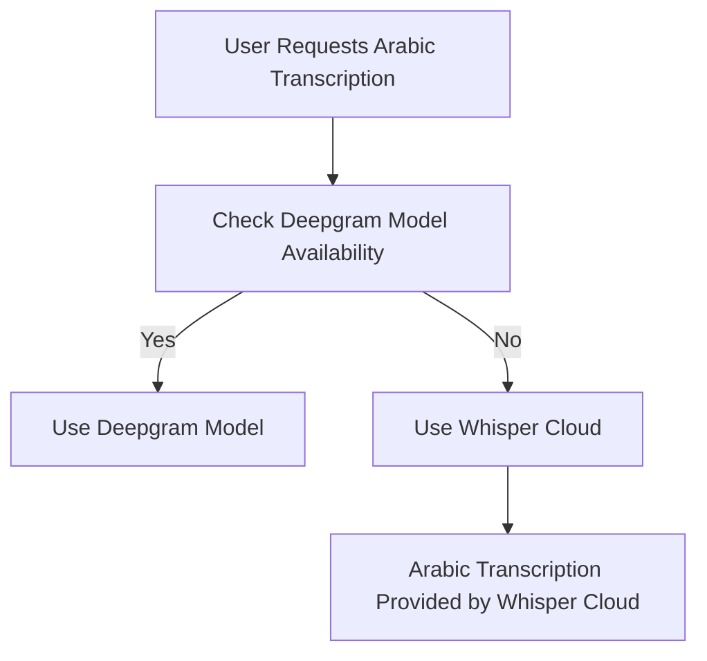

# Arabic Language Support at Deepgram

Deepgram is committed to providing top-tier transcription services but, as of now, does not have native support for the Arabic language through its primary Deepgram Models. However, understanding the demand for Arabic transcription, Deepgram offers an alternative through its Whisper Cloud service. 

## Language Support Options

### Whisper Cloud
Whisper Cloud offers support for multiple languages, including Arabic. It's important to note, however, that while it supports Arabic, its performance might not match that of the other more advanced Deepgram Models like Nova-2.

Whisper Cloud is a reliable service for users who require Arabic transcription and are looking for a solution integrated within the Deepgram ecosystem.

For more details about supported languages in Whisper Cloud, visit the [Deepgram Whisper Cloud Documentation](https://developers.deepgram.com/docs/deepgram-whisper-cloud#supported-languages).

## Looking Ahead
Deepgram continuously evaluates and expands its language model capabilities based on user needs and advancements in language processing technology.

If you have specific requirements or feedback, engage with the Deepgram community through our [Discord](https://discord.gg/deepgram) or reach out to your support representative.

### Diagram: Language Support Overview with Whisper Cloud
The following flowchart outlines the process for selecting language support via Whisper Cloud:

In conclusion, if Arabic transcription is a priority, Whisper Cloud is currently your best option within the Deepgram suite. For further support, join our vibrant community on [Discord](https://discord.gg/deepgram) or reach out directly to support channels.

### References
- [Deepgram Whisper Cloud Documentation](https://developers.deepgram.com/docs/deepgram-whisper-cloud#supported-languages)