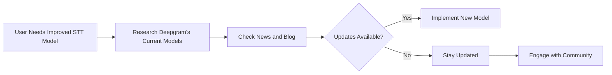

# Exploring Deepgram's Upcoming STT Model Releases

Deepgram continuously aims to enhance its Speech-to-Text (STT) models to deliver high accuracy, low latency, and scalable solutions. If you're using Deepgram's Nova 2 model but require updates due to other providers offering advancements, you may be interested in understanding Deepgram's future model developments.

## Future STT Developments

While specifics on each release aren't always available publicly immediately, Deepgram is known for regularly updating its models to improve quality, efficiency, and user experience. Recently, Deepgram introduced the Nova 3 model, which offers significant advancements in STT capabilities. Users can already start utilizing this model using the parameter `model=nova-3`.

## Monitoring Updates

For the latest updates and announcements regarding Deepgram's product developments, consider the following strategies:

- **Visit Official Channels:** Regularly check Deepgram's [news channel](https://community.deepgram.com) and [company blog](https://www.deepgram.com/blog) for any official announcements.
- **Community:** Engage in the Deepgram [Discord community](https://discord.gg/deepgram) for real-time discussions and updates from other users and the Deepgram team.

This diagram shows a simplified decision process for staying informed about new STT models and updates.

## Conclusion

Deepgram remains committed to delivering top-tier STT solutions with its Nova models. Employing strategic channels to stay informed about upcoming releases can ensure you maintain cutting-edge service quality and meet your Speech-to-Text requirements.

For related discussions or assistance, reach out to your Deepgram support representative or our community: [Deepgram Discord](https://discord.gg/deepgram)

**References**
- [Deepgram News and Blog](https://community.deepgram.com)
- [Deepgram Discord](https://discord.gg/deepgram)