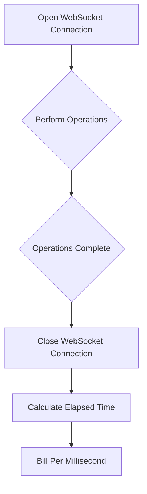

# Understanding Deepgram Voice Agent API Pricing and Time Calculation

In using the Deepgram Voice Agent API, understanding the pricing structure and how "hours" are calculated is essential for effective budget management and planning. Here, we explore how Deepgram calculates usage time for its voice agent services and how this impacts billing.

## How Usage Time is Calculated

The time calculation for the Deepgram Voice Agent API is based on the duration the WebSocket connection remains open. This means the "hour" of usage is measured from the moment the WebSocket connection is established to when it is closed. It's essential to understand that this covers the total time the WebSocket remains active, not just the processing time for the tasks being executed (such as conversions from text-to-speech, speech-to-text, etc.).

## Billing Precision

Deepgram charges based on the duration of the WebSocket connection time in milliseconds. The billing mechanism ensures that you pay precisely for the amount of time the connection is used, allowing for accurate cost estimation and control. However, there is a specific rule applied—no rounding is performed except in cases where the usage is less than one second, in which it will be rounded up to one full second.

### Visualizing the Process

## Conclusion

Using the Deepgram Voice Agent API's pay-as-you-go pricing model ensures you are billed precisely for the connection time in milliseconds, helping you manage your usage efficiently. This transparency supports optimal resource allocation and budget planning.

If issues persist or the system behavior seems inconsistent, reach out to your Deepgram support representative (if you have one) or visit our community for assistance: [https://discord.gg/deepgram](https://discord.gg/deepgram)

## References

- [Voice Agent API Pricing](https://developers.deepgram.com/docs/voice-agent#pricing)