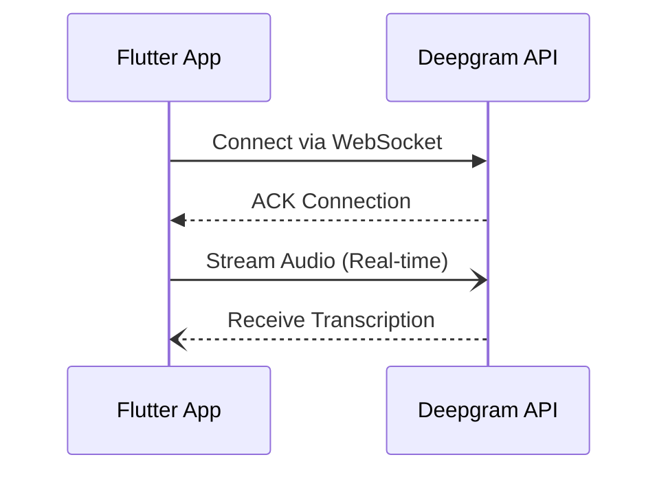

# Implementing Live Streaming Audio-to-Text in Flutter Apps

Incorporating live streaming audio-to-text capabilities into a Flutter app with Deepgram can enhance user experience by providing real-time transcription. While a majority of Deepgram's documentation focuses on web-based implementations, extending these functionalities to mobile platforms is equally feasible and beneficial.

## Getting Started with Deepgram in Flutter

Flutter is a UI toolkit for building natively compiled applications for mobile from a single codebase. When utilizing Deepgram's API for live transcription, you will primarily interact with the WebSocket endpoint: `wss://api.deepgram.com/v1/listen`.

### Setup

1. **Deepgram API Key**: First, ensure that you have an active Deepgram API key. This will be necessary for authenticating your requests.

2. **Environment Configuration**: If you're new to Flutter, start by setting up your Flutter environment. Detailed steps can be found on the [Flutter website](https://flutter.dev/docs/get-started/install).

3. **Plugin or Package Selection**: Currently, there aren't official Deepgram Flutter packages, but some community-driven plugins and packages are available:
   - [Deepgram Speech to Text package on Pub.dev](https://pub.dev/packages/deepgram_speech_to_text)
   - [GitHub repository for deepgram_speech_to_text](https://github.com/tempo-riz/deepgram_speech_to_text)

4. **WebSocket Integration**: Use Flutter's built-in WebSocket capabilities to connect to Deepgram's live transcription API. Flutter’s package `websocket` can be used for this purpose, but be mindful of managing WebSocket states appropriately.

### Example Flow

Below is a high-level flow of how you can implement live transcription:

### Best Practices

- **Error Handling**: Implement robust error handling for different WebSocket events (e.g., connection closed, unexpected messaging).
- **Rate Limiting and Quotas**: Track your usage metrics to ensure you're within the allocated limits provided by your Deepgram plan.

## Conclusion

Implementing live audio-to-text transcription in a Flutter app is a powerful addition that can greatly improve user engagement. Utilize available WebSocket support within Flutter and community resources to facilitate this integration.

If issues persist or the system behavior seems inconsistent, reach out to your Deepgram support representative (if you have one) or visit our community for assistance: [Deepgram Discord Community](https://discord.gg/deepgram).

## References

- [Deepgram API Documentation](https://developers.deepgram.com/docs/getting-started-with-live-streaming-audio)
- [Deepgram Speech to Text Package](https://pub.dev/packages/deepgram_speech_to_text)
- [Flutter WebSockets Documentation](https://flutter.dev/docs/cookbook/networking/web-sockets)

Thanks to the Deepgram community for exploring these integrations and sharing their insights!