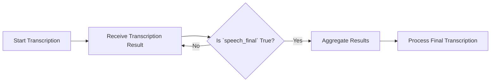

# Managing Result Intervals in Deepgram Live Transcription

Using Deepgram's live transcription service, users may need to customize the frequency of transcription results and understand how to interpret certain signals to efficiently manage transcription output.

### Frequency of Final Results in Live Transcription

Deepgram sends transcription results labeled as `is_final=True` every few seconds during live processing. Understanding how to manage these results can help optimize integration, especially when combining transcriptions with other processing stages like language models.

#### How It Works

- **Result Frequency:** Transcription results are processed and returned approximately every 3-5 seconds. This timeframe is largely determined by the internal mechanism that processes and batches audio data for transcription.
- **Customization Options:** Currently, Deepgram's API does not allow direct configuration to set a specific interval for receiving `is_final` results, such as extending this to 10 seconds. Users seeking less frequent updates may need to implement a custom solution that buffers and aggregates results on the client-side.

#### Aggregating Results

If users wish to gather results over a longer period before processing them further, such as sending them to a language model, they can use a client-side buffering system. This setup would accumulate interim results into larger batches for processing.

### Interpreting `speech_final`

The `speech_final` parameter is an essential part of understanding transcriptions:

- **Defining End of Utterance:** This parameter indicates the completion of a segment, marking the transcription's finality for the current utterance.
- **Optimizing Processing:** Relying on `speech_final` ensures that processing, such as sending data to a language model, occurs only when a full and final transcription has been generated, avoiding partial or incomplete interpretation.

### Flowchart

### Conclusion

Understanding and managing the behavior of Deepgram's live transcription results enables users to effectively integrate the transcription service into broader systems, such as those using language models. While some custom handling may be necessary, particularly around buffering results, awareness of parameters like `speech_final` ensures a clearer and more accurate transcription flow.

For further assistance or up-to-date information, always refer to [Deepgram's official documentation](https://developers.deepgram.com/docs/streaming). If system behaviors vary or problems persist, consider reaching out via [Deepgram's community](https://discord.gg/deepgram) for support.

#### References
- [Deepgram API Documentation](https://developers.deepgram.com/docs/streaming)
- [Community Discussions](https://github.com/orgs/deepgram/discussions/1156)
- [Discord Community](https://discord.gg/deepgram)
