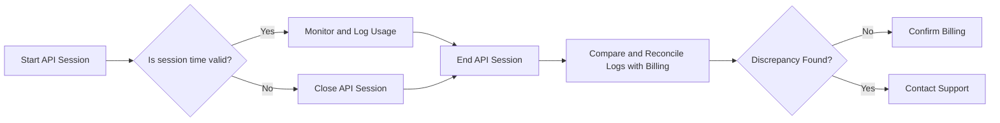

# Managing Unexpected Billing in Deepgram Voice Agent API

Testing the Deepgram Voice Agent API can sometimes result in unexpected billing, especially during development and experimentation phases when practices like manual session management may lead to billing anomalies. This documentation provides guidance on monitoring and managing API usage to mitigate such issues.

### Monitoring API Usage

When testing the Voice Agent API, you can track the duration of your API usage by implementing proper logging and tracking mechanisms in your application. This will allow you to reconcile your usage with the billed hours shown in your Deepgram dashboard.

1. **Log Session Duration**: Implement logs that capture the start and end times of each session. This can be done by recording timestamps when the connection opens and closes.
2. **Automate Session Closure**: Utilize scripts or software features that ensure connections are closed after a specified period. This can prevent sessions from unintentionally remaining open for extended durations.
3. **Regular Auditing**: Regularly audit your API usage as shown in your Deepgram dashboard against your logs to identify discrepancies early.

### Handling Unexpected Charges

If you encounter unexpected charges on your Deepgram account, there are several steps you can take:

- **Review Your Logs**: Compare your session logs with the billed hours to confirm any discrepancies between your expected usage and what is billed.
- **Contact Support**: If discrepancies are confirmed, reach out to Deepgram support or visit the community at [Discord](https://discord.gg/deepgram) for assistance. They can help investigate and potentially rectify billing errors.

### Example Workflow

Here is a simplified diagram to illustrate monitoring and managing sessions with the Voice Agent API:

### Conclusion

By properly managing and monitoring your API sessions, you can avoid unexpected charges and maintain control over your usage. In case of issues, Deepgram's support team can assist you in resolving billing anomalies.

If issues persist or the system behavior seems inconsistent, reach out to your Deepgram support representative (if you have one) or visit our [community](https://discord.gg/deepgram) for assistance.

### References

For more details, visit the following links:

- [Deepgram Voice Agent Documentation](https://developers.deepgram.com/docs/voice-agent)
- [Deepgram Community Discord](https://discord.gg/deepgram)