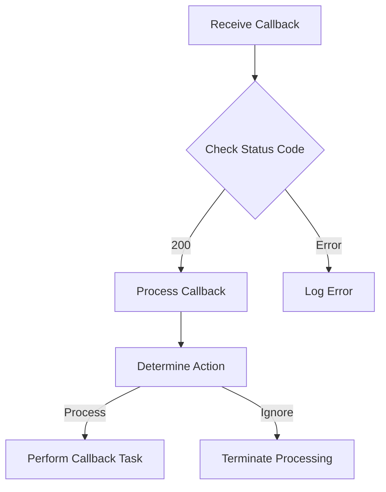

<CommunityQuestion>I'm integrating Deepgram's speech-to-text API and using a callback URL. Is there a way to manage how callback retries are handled, such as limiting it to a single attempt?</CommunityQuestion>

When using Deepgram's Speech-to-Text (STT) service with a callback URL, the default system behavior is to retry the callback up to 10 times if it receives an unsuccessful HTTP status code. This automatic retry mechanism ensures that temporary connectivity issues or server errors are handled by repeatedly attempting the callback.

However, there are instances where you might want to adjust this behavior and effectively manage how retries are conducted, especially if you want the callback to only be attempted once regardless of its success or failure. While Deepgram does not provide a direct configuration switch to change the retry policy, you can implement server-side logic to achieve an effect of a single callback attempt.

### Custom Server-side Logic

1. **Successful HTTP Status:** Modify your callback server to always return a successful HTTP status code (200-299) upon receiving the callback request, even if there are internal errors. By doing so, Deepgram's retry mechanism will not trigger further attempts because it assumes the callback was successfully acknowledged.

2. **Process Management:** Implement business logic within your callback handler to decide whether to process the incoming callback or ignore it based on your criteria. This logic can check conditions like attempt count, request validity, or any other factors significant to your system.

Here is a basic flow diagram of how you might structure the callback request handling:

For more specific control over the callback behavior or if additional options are needed beyond the provided workaround, you can reach out to Deepgram's support for further assistance. Visit our community for more support or discuss with your Deepgram representative: https://discord.gg/deepgram

#### Conclusion
By implementing server-side logic to handle the callback's HTTP response status and manage processing conditions, you can mitigate unintended retries from Deepgram's default behavior. This approach empowers you to efficiently handle scenarios where only a single callback attempt is desired, aligning with your operational needs.

#### References
- [Deepgram Callback Documentation](https://developers.deepgram.com/docs/callback)