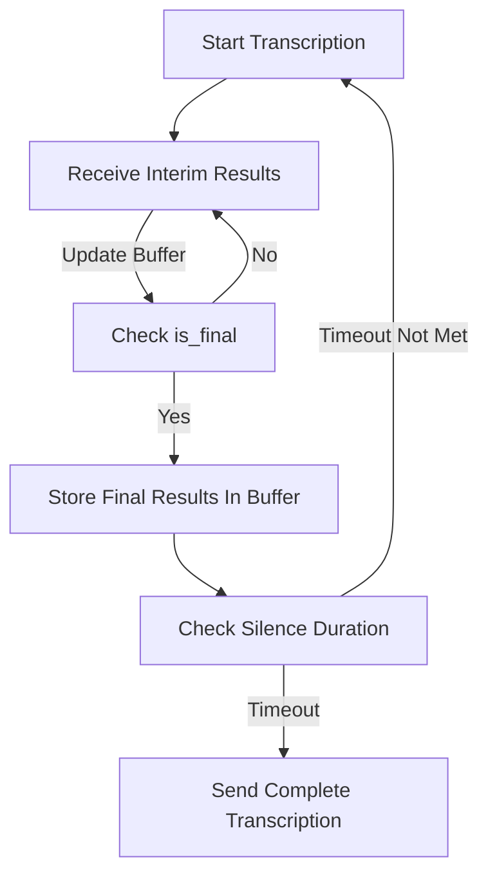

<CommunityQuestion>I'm working on a project that requires real-time speech transcription, but I'm having trouble managing the interim and final transcription results from Deepgram's API. How can I effectively handle these transcription segments to ensure accurate and complete transcripts?</CommunityQuestion>

Real-time transcription allows developers to display audio transcriptions instantaneously as speech is processed, enhancing the immediacy of user interactions. However, managing the sequence of transcriptions efficiently is vital for applications required to send complete transcripts post-speech events. In particular, the `is_final` flag provided by Deepgram's API indicates when a segment of speech is considered final, and developers can leverage this to optimise transcript handling.

### Managing Transcription Segments

When utilising the Deepgram API for real-time transcription via a WebSocket connection, understanding how to handle interim and final results is crucial. Each data event can include:
- **Interim results:** Transcriptions that may change as more audio is processed.
- **Final results:** Transcriptions that Deepgram considers complete for a segment.

#### Buffer Strategy

Implementing a "buffer" variable can help manage displayed text and determine when to send complete transcripts to a backend service. This approach includes storing interim results and updating them upon receiving final results.

- **Initialise Buffer:** Initialise a buffer to store text between events.
- **Update Buffer:** Concatenate new interim results to the buffer.
- **Check Finalisation:** When `is_final` is `true`, store the buffer content, reset the buffer, and prepare for the next segment out of silence.
- **Send Complete Transcripts:** After a set duration of silence (i.e., when no new `is_final` events occur within a specified time window), compile and send the complete transcription.



### Implementing Message Handling

To implement this logic, a WebSocket listener can handle message parsing and buffer management:

```javascript
// Import necessary modules
const WebSocket = require('ws');

// Example pseudocode for managing buffer
let buffer = ''; // Buffer to store transcriptions
let silenceTimeout;

// Connect to Deepgram WebSocket API
const websocket = new WebSocket('wss://api.deepgram.com/v1/listen', {
  headers: { Authorization: 'Token YOUR_API_KEY' }
});

websocket.onmessage = (event) => {
  try {
    const data = JSON.parse(event.data);
    if (data.is_final) {
      buffer += data.transcript;
      clearTimeout(silenceTimeout);
      silenceTimeout = setTimeout(() => {
        sendToBackend(buffer); // Function to handle sending the transcription
        buffer = ''; // Reset buffer
      }, 1000); // SILENCE_PERIOD in milliseconds
    } else {
      buffer += data.transcript; // Append interim results
    }
  } catch (error) {
    console.error('Error processing message:', error);
  }
};

websocket.onerror = (error) => {
  console.error('WebSocket error:', error);
};
```

### Further Resources

- [Understanding Endpointing and Interim Results](/docs/understand-endpointing-interim-results)
- [Deepgram JavaScript SDK](https://github.com/deepgram/deepgram-js-sdk)

### Conclusion

Implementing a buffer strategy enables efficient real-time transcription management with Deepgram's API, allowing applications to provide immediate transcription feedback while sending complete transcripts post-silence. If issues persist or the system behaviour seems inconsistent, reach out to your Deepgram support representative (if you have one) or visit our community for assistance: [Deepgram Discord Community](https://discord.gg/deepgram).

### References

- [Endpointing](../../docs/endpointing)
- [Interim Results](../../docs/interim-results)