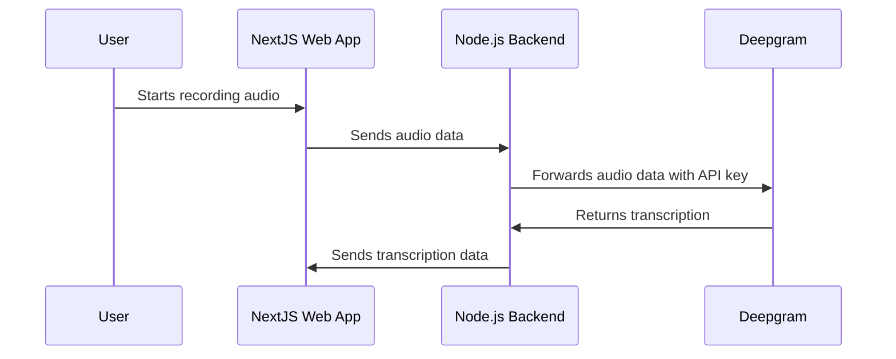

# Building a secure speech-to-text system with NextJS and Node.js

When developing a speech-to-text tool using a web app integrated with Deepgram, one of the considerations is ensuring that sensitive details, such as the Deepgram API key, remain secure. This article outlines best practices for setting up your tool using NextJS and Node.js, while keeping the API key safe from exposure to end users.

## Overview

To achieve a secure and scalable speech-to-text tool, you can employ a multi-tier architecture wherein a NextJS web app communicates with a Node.js backend. The backend handles requests to Deepgram, ensuring sensitive credentials are not exposed to end users.

### Architecture Flow

### Implementing the Proxy

By configuring a Node.js server to act as a proxy between your web app and Deepgram's API, you prevent direct API key exposure. The NextJS app is responsible for collecting audio data from users and passing it securely to the Node.js server.

1. **Audio Recording**: Use the web app to access user microphones and record audio. Libraries such as MediaStream and MediaRecorder are suitable for handling these tasks.
   
2. **Audio Transmission**: Once the audio is recorded, it is sent to the Node.js backend. This can be done using secure HTTP requests (HTTPS) or WebSockets if real-time processing is needed.

3. **Node.js Proxy**: The backend server processes incoming audio, attaches the Deepgram API key, and forwards the data to Deepgram’s API for transcription.

4. **Data Handling**: After receiving the transcription from Deepgram, the Node.js server can store the transcription, send it back to the web app, or perform additional processing as needed.

### Example Code/Repositories

To streamline development, you might consider exploring repositories like [Deepgram Node Proxy](https://github.com/deepgram-devs/deepgram-node-proxy). This example outlines the setup of a node proxy server to handle communication with Deepgram safely.

## Security Considerations

- **API Key**: Never expose your Deepgram API key directly in client-side code.
- **Secure Transmission**: Use HTTPS for all client-server communication to prevent interception.
- **Server-Side Logic**: Keep client-side scripts lightweight. Move as much logic as possible to the server side to maintain control and security.

## Conclusion

By integrating a secure Node.js backend with your NextJS web app to proxy communication with Deepgram, you can protect sensitive credentials while providing robust speech-to-text functionality. This approach not only protects your API keys but also enables a more scalable and maintainable architecture.

For more insights and custom implementation details, consider reaching out to your Deepgram support representative or visiting our community: [Deepgram Community on Discord](https://discord.gg/deepgram).

## References

- [Deepgram API Documentation](https://developers.deepgram.com)
- [NextJS Documentation](https://nextjs.org/docs)
- [Node.js Documentation](https://nodejs.org/en/docs)