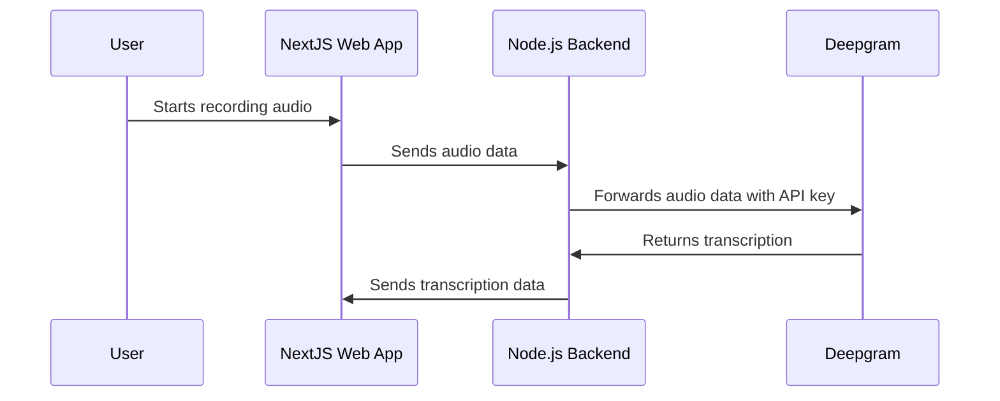

<CommunityQuestion>I'm developing a speech-to-text application that utilises Deepgram's API, but I'm concerned about exposing my API key to the client-side. How can I securely integrate Deepgram's API in a NextJS and Node.js setup?</CommunityQuestion>

## Problem Statement

When developing a speech-to-text tool using a web app integrated with Deepgram, one of the considerations is ensuring that sensitive details, such as the Deepgram API key, remain secure. This article outlines best practices for setting up your tool using NextJS and Node.js, while keeping the API key safe from exposure to end users.

## Overview

To achieve a secure and scalable speech-to-text tool, you can employ a multi-tier architecture wherein a NextJS web app communicates with a Node.js backend. The backend handles requests to Deepgram, ensuring sensitive credentials are not exposed to end users.

### Architecture Flow



### Implementing the Proxy

By configuring a Node.js server to act as a proxy between your web app and Deepgram's API, you prevent direct API key exposure. The NextJS app is responsible for collecting audio data from users and passing it securely to the Node.js server.

```javascript
// server.js
const express = require('express');
const fetch = require('node-fetch');
require('dotenv').config();

const app = express();
app.use(express.json());

app.post('/transcribe', async (req, res) => {
  try {
    const audioData = req.body.audio;
    const response = await fetch('https://api.deepgram.com/v1/listen', {
      method: 'POST',
      headers: {
        'Authorization': `Token ${process.env.DEEPGRAM_API_KEY}`,
        'Content-Type': 'application/json',
      },
      body: JSON.stringify({ audio: audioData }),
    });

    const transcription = await response.json();
    res.json(transcription);
  } catch (error) {
    console.error('Error:', error);
    res.status(500).json({ error: 'Internal server error' });
  }
});

app.listen(3000, () => console.log('Server listening on port 3000'));
```

Be sure to replace `YOUR_DEEPGRAM_API_KEY` with your actual API key stored securely in an environment variable.

### Security Considerations

- **API Key Management**: Never expose your Deepgram API key directly in client-side code.
- **Secure Transmission**: Use HTTPS for all client-server communication to prevent interception.
- **Error Handling**: Implement comprehensive error handling as shown in the example.
- **Session Management**: Manage sessions securely to prevent hijacking.
- **Alternative Solutions**: Consider implementing rate limiting and rotating API keys regularly.

## Conclusion

By integrating a secure Node.js backend with your NextJS web app to proxy communication with Deepgram, you can protect sensitive credentials while providing robust speech-to-text functionality. This approach not only protects your API keys but also enables a more scalable and maintainable architecture.

For more insights and custom implementation details, consider reaching out to your Deepgram support representative or visiting our community: [Deepgram Community on Discord](https://discord.gg/deepgram) and [GitHub Discussions](https://github.com/deepgram-devs).

## References

- [Deepgram API Documentation](/reference/)
- [NextJS Documentation](https://nextjs.org/docs)
- [Node.js Documentation](https://nodejs.org/en/docs)