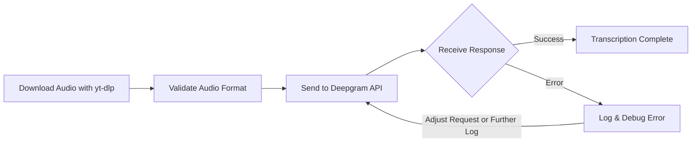

# Solving JSON Parsing Errors with Deepgram SDK for YouTube Audio

When integrating the Deepgram SDK to transcribe audio extracted from YouTube videos using a web application, users may encounter errors like invalid JSON being returned as part of the response. This guide covers troubleshooting steps to ensure that you can successfully transcribe audio from YouTube using the Deepgram SDK.

## Understanding the Error

The error message `DeepgramUnknownError: Unexpected token` typically occurs when the response from Deepgram's API is not in the expected JSON format. Instead, it might be HTML, indicating an error page.

## Steps to Resolve

### 1. Verify API Endpoint
Ensure you are using the correct API endpoint for transcription. For pre-recorded audio, use:
`https://api.deepgram.com/v1/listen`

### 2. Validate Audio Stream
Make sure the audio stream being sent is compatible with Deepgram's requirements. Double-check the MIME type and file format to ensure they are supported. Use tools like `ffmpeg` ([FFmpeg Documentation](https://ffmpeg.org/documentation.html)) to re-encode the audio if needed.

### 3. Check yt-dlp Output
If you're using `yt-dlp` to download the audio from YouTube:
- Ensure you're running the latest version of `yt-dlp` to handle YouTube's API changes as noted in their [issue backlog](https://github.com/yt-dlp/yt-dlp/issues).
- Validate that the command outputs valid audio data, and if piping directly, that the audio data is processed as expected.

### 4. Handle Network and Access
Verify network access to Deepgram's API. Use tools like `curl` or Postman to test connectivity manually. Make sure the API key is valid and has the necessary permissions.

### 5. Detailed Logging
Enhance logging in your code to capture the HTTP request and response. This can help you see what data is sent to Deepgram and the type of response received.

### 6. Debugging Responses
Capture complete HTTP responses to gain insights into potential issues. Consider logging additional error fields returned by Deepgram to identify specific problems.

### 7. Adjust Request Handling
Attempt downloading the audio to a temporary file before sending it to Deepgram. This can help determine if the issue stems from incorrect stream handling.

### Example Flow
Below is a flowchart diagram depicting the steps involved in processing and transcribing YouTube audio using the Deepgram SDK:

## Conclusion
By following these troubleshooting steps, you should be able to resolve issues related to JSON parsing errors from the Deepgram SDK when processing audio from YouTube. If issues persist or the system behavior seems inconsistent, reach out to your Deepgram support representative (if you have one) or visit our community for assistance: [https://discord.gg/deepgram](https://discord.gg/deepgram).

## References
- [Next.js Documentation](https://nextjs.org/docs)
- [yt-dlp GitHub Repository](https://github.com/yt-dlp/yt-dlp)
- [Deepgram SDK for JavaScript/TypeScript](https://github.com/deepgram/deepgram-js-sdk)