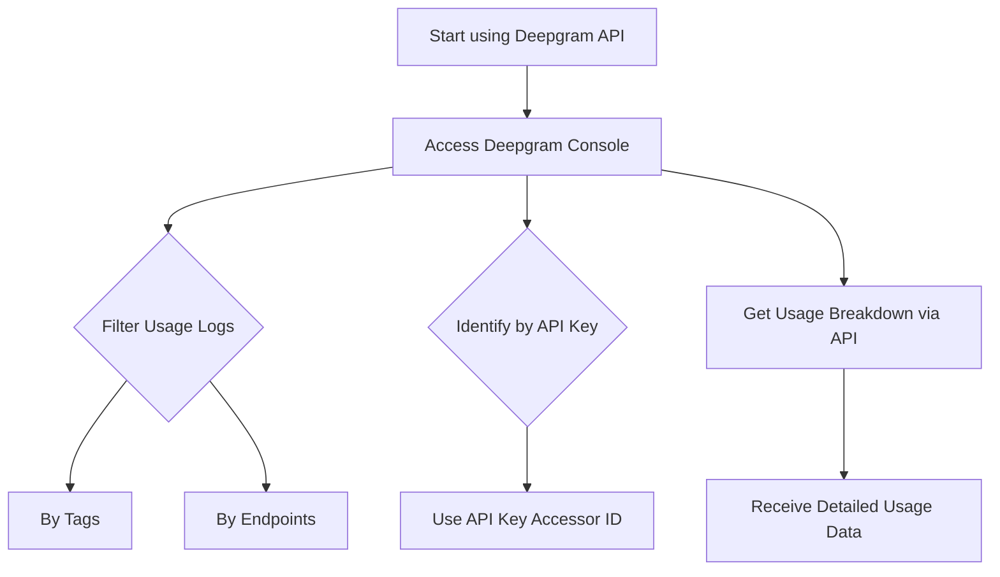

# Tracking API Usage with Keys and Tags on Deepgram

Tracking and managing API usage can be efficiently handled using Deepgram's platform, as there are built-in tools and endpoints specifically designed for this purpose.

Deepgram provides multiple ways to monitor and track API usage:

### Console Usage Logs

Deepgram’s console offers a user-friendly interface where you can filter and examine your API usage. The usage logs allow you to filter by Tags and specific API Endpoints, giving you a broad spectrum of tracking options directly from the user interface. More detailed guidance on these can be found in [Deepgram's Usage Logs Documentation](https://developers.deepgram.com/docs/using-logs-usage#understanding-console-usage-log-states).

### Tracking with API Keys

To monitor usage at the API key level, you can leverage the API Keys accessor ID, which acts as a unique public identifier for each key. This ensures that you can track usage linked, especially to individual API keys, which can be crucial for analyzing consumption patterns on a per-key basis.

### Usage Breakdown via API

For programmatically obtaining detailed usage statistics, you can make use of the [Get Project Usage Breakdown endpoint](https://developers.deepgram.com/reference/management-api/usage/get-breakdown). This API call provides comprehensive usage information and additional options to explore and understand how your services and resources are being used over time.

If issues persist or the system behavior seems inconsistent, reach out to your Deepgram support representative (if you have one) or visit our community for assistance: [https://discord.gg/deepgram](https://discord.gg/deepgram)

#### Flow of Tracking API Usage

Here's a simplified flow of how you can track Deepgram's API usage:

### Conclusion

Deepgram provides numerous ways to track your API usage, including UI and API-based solutions. Whether through the console for manual inspection or through API endpoints for automated data gathering, these tools are engineered to help you manage and optimize your Deepgram integrations effectively.

### References
- [Usage Logs](https://developers.deepgram.com/docs/using-logs-usage#understanding-console-usage-log-states)
- [Get Usage Breakdown API](https://developers.deepgram.com/reference/management-api/usage/get-breakdown)
- [Deepgram Community on Discord](https://discord.gg/deepgram)