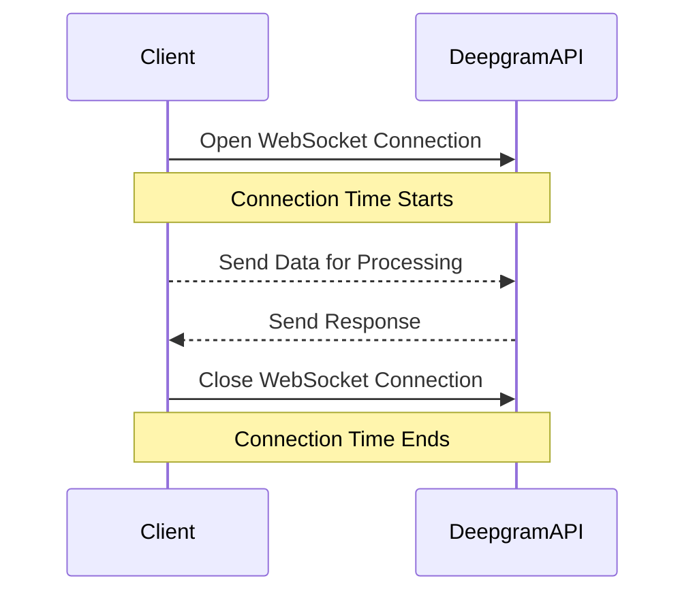

# Understanding the Pricing of Deepgram's Voice Agent API

Deepgram's Voice Agent API offers pay-as-you-go pricing, which can prompt questions regarding the definition and calculation of usage time. This article aims to clarify what constitutes an "hour" in the context of using the Voice Agent API.

## What is an "Hour"?

When utilizing the Voice Agent API, an "hour" is defined by the duration for which a WebSocket connection remains open. This means the calculation of usage time begins the instant the WebSocket connection is established, and it ends the moment the connection is closed. This does **not** refer to the length of time spent processing the data, such as converting text to speech, speech to text, or handling language model conversions.

The distinction is significant because it directly impacts how pricing is calculated for those using the API on the pay-as-you-go plan.

## Managing WebSocket Connections

Given that pricing is based on connection time, it's beneficial to manage WebSocket connections efficiently. Consider implementing strategies that close connections as soon as the task is completed to optimize usage.

 

## Conclusion

Understanding how your usage time is calculated can help you effectively manage costs when interacting with Deepgram's Voice Agent API. Since the time is measured based on the WebSocket connection duration, optimizing these connections can be crucial.

For more detailed information or any further assistance, please refer to the [Voice Agent Documentation](https://developers.deepgram.com/docs/voice-agent#pricing) or reach out to our community support: [Deepgram Discord](https://discord.gg/deepgram).

## References

- [Voice Agent API Documentation](https://developers.deepgram.com/docs/voice-agent#pricing)
- [Deepgram Community on Discord](https://discord.gg/deepgram)