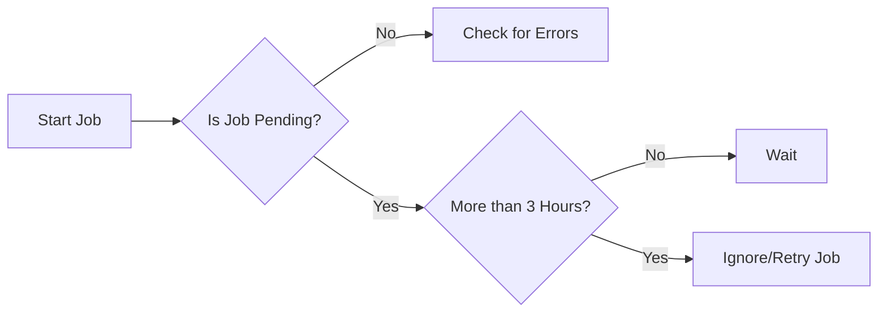

# Handling Whisper Model Transcription Delays in Deepgram

For users utilizing our Whisper models for transcription, it's key to recognize some inherent performance limitations compared to our Deepgram models. If possible, opt for a Deepgram model like Nova, as these provide greater scalability and faster results.

## Whisper Model Limitations

1. **Scalability Challenges**: Whisper models feature less scalability due to their inherent architecture, impacting their ability to handle higher loads efficiently. In contrast, Deepgram models excel in higher scalability with quicker result returns.

2. **Timeout Constraints**: Be aware that all Deepgram models, including Whisper, have a 10-minute timeout. Any transcription requests running beyond this period will encounter a 504 error.

3. **Service Level Agreements**: At present, SLAs are not offered for Whisper models, which means users should plan their architecture and service expectations accordingly.

## Managing Stuck Jobs

When jobs appear "stuck," transitioning between states like "pending" to "unknown," and eventually "lost," consider allowing a maximum of 3 hours to see if they resolve. If not, jobs can be safely ignored to maintain queue efficiency.

To mitigate issues with Whisper models, users might need to evaluate their workflow to minimize dependency on these models or consider the following steps:
- Shift to a Deepgram model, if feasible.
- Develop monitoring and management systems to handle timeouts effectively.

### Suggested Workflow for Monitoring Jobs

For transcripts requiring over 10 minutes, consider breaking down audio inputs or managing job batches. If performance issues persist, contact your Deepgram support representative or visit our [community](https://discord.gg/deepgram) for assistance.

---

**References:**
- [Whisper Model and Hosted Model Differences](https://community.deepgram.com)  
- [API Documentation](https://developers.deepgram.com/docs/getting-started-with-pre-recorded-audio)  
- [Discord Community](https://discord.gg/deepgram)